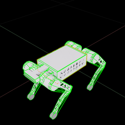

# Ayg Robot Description (USD)

For the URDF description, see the [`ros2`](https://github.com/ddebenedittis/ayg_description/tree/ros2) branch.

## Overview

This package contains the robot description (USD) of Ayg developed by [Cyber-Fusion](https://github.com/Cyber-Fusion).

Updated to the URDF version dated March 1st, 2024.



## How to Generate

Can be generated from the `urdf` with the following script:
```bash
./isaaclab.sh -p scripts/tools/convert_urdf.py \
    ./ayg_description/urdf/ayg.urdf \
    ./ayg_usd/ayg.usd \
    --joint-stiffness 0.0 \
    --joint-damping 0.0 \
    --joint-target-type none \
    --headless
```

## License

TODO
